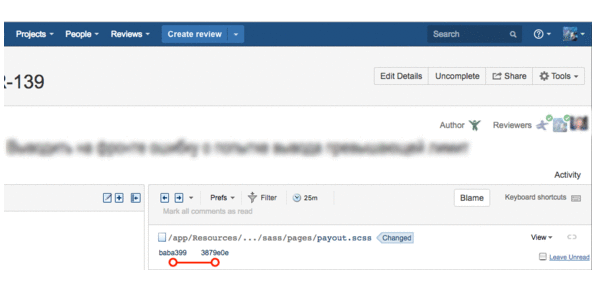

# Crucible connector for open review files in PhpStorm IDE

Open files from code review in IDE.



## Requirements

PhpStorm 2018.+

Crucible 4.4.1+

## Installation

Download crucible-connector.phar in you project

```
Create runner in Preferences | Tools | External Tools:
Name: crucible-connector
Description: Run built-in server for open files from crucible in PhpStorm
Program: php
Arguments: -S localhost:51235 crucible-connector.phar
Working directory: $ProjectFileDir$
```

Optional settings:

In __Preferences | Build, Execution, Deployment | Debugger__ set Allow unsigned request in true. 


## Usage

__Main menu | Tools | External Tools | crucible-connector__

## Todo

* Realize port mapping for custom built-in IDE server port setting (workflow with multiple projects simultaneously)
* Make possibility checkout branch from review
